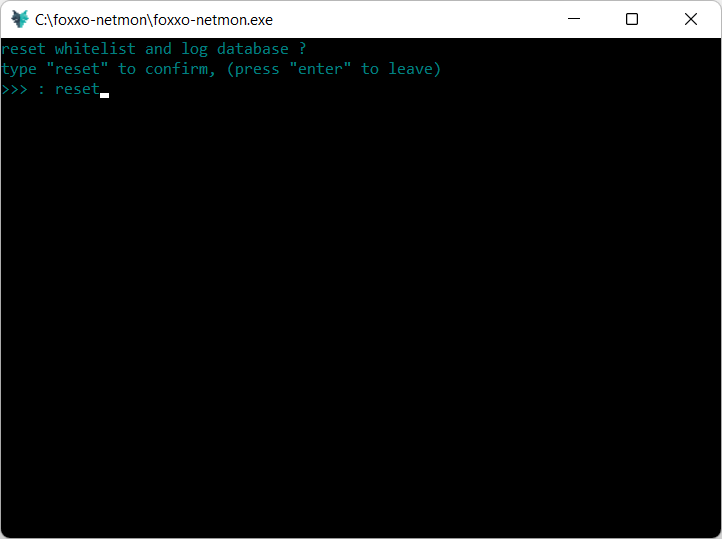

## foxxo-netmon
##### **current version : v1.5.3 pre-release**

  

**foxxo-netmon** is a network guardian written in python. This netmon is made spacifically to protect Gta Online players from **modders** and **griefers**. 

This tool offers control over who can enter your session. If you're a lone grinder, enjoy the solitude of a strictly locked **solo session**. On the other hand, add friends to your whitelist and enjoy grinding without being disturbed by unwanted players.

## feature highlights
- **autolock**
  - Automatically detect players present in session over a 30 second window and **lock** the session with those players.
  - These players are not added to your **whitelist**. They are only temporarily allowed to be in your session. 

  

- **whitelist & action logs**
  - Manage your **whitelist** by adding or dropping players by **ip**. Running a **whitelisted session** allows you to make sure only these players can enter your session at any time  
  - Every player added to or dropped from your whitelist is recorded by ip, status and timestamp to the **log database** for future reference. 

  
  

## checksums

#### MD5 hash of file applicationX64.zip:
85 0d d9 6b a4 ec 3f 77 5a f7 5f f8 2c 40 c8 d4

#### SHA256 hash of file applicationX64.zip:
9a 2f 79 bb 53 9c a3 2b b2 41 1b 66 ce 54 17 9b 0c 4e 97 ec 80 e6 46 4d ac 04 30 5a 23 c5 9b 1e

#### SHA512 hash of file applicationX64.zip:
b8 89 59 d1 c7 8e 5f 22 21 f5 1d cd 74 6d 7e b9 f8 79 dd 58 da f5 62 00 2b 66 37 21 65 64 b3 ea ee d1 1d 36 db 2a ac dd 10 8a 5a ae 99 cd 16 16 4a 01 95 02 c1 ce b3 ec c0 6f ef 14 5b ce 19 16
