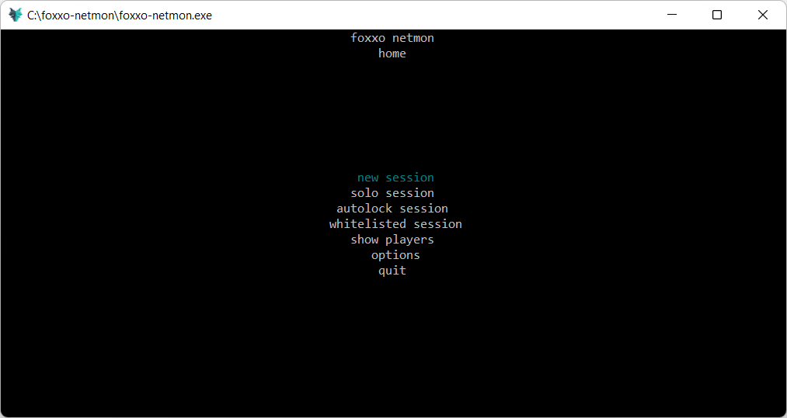
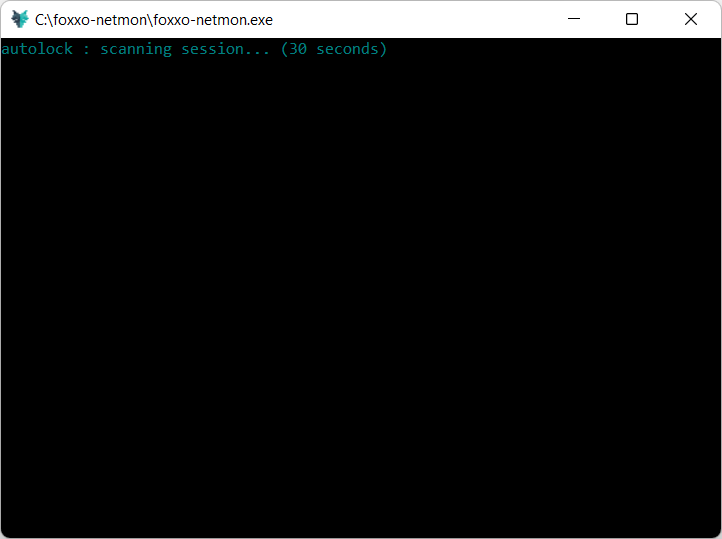
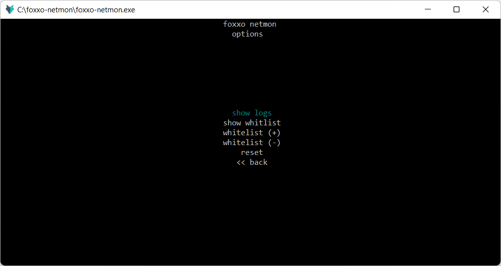

## foxxo-netmon
##### current version : v1.5.3 pre-release

  

foxxo-netmon is a network guardian written in python. This netmon is made spacifically to protect Gta Online players from modders and griefers. 

This tool offers control over who can enter your session. If you're a lone grinder, enjoy the solitude of a strictly locked solo session. On the other hand, add friends to your whitelist and enjoy grinding without being disturbed by unwanted players.

## feature highlights
- autolock
  - Automatically detect players present in session over a 30 second window and lock the session with those players.
  - These players are not added to whitelist. They are only temporarily allowed to be in your session. 
- whitelist
  - Manage your whitelist by adding or dropping players by ip. Running a whitelisted session allows you to make sure only these players can enter your session at any time  
- action logs
  - Every player added to or dropped from your whitelist is recorded by ip, status and timestamp to the log database for fure reference. 

  
  

## checksums

#### MD5 hash of file anonymousfoxxo-foxxo-netmon-v1.5.3-pre-release-1-g0efd5f6.zip:
93 97 7b 05 d2 ba 31 7f a5 2d 62 5a 2b 60 9f f7

#### SHA256 hash of file anonymousfoxxo-foxxo-netmon-v1.5.3-pre-release-1-g0efd5f6.zip:
b4 d2 e6 ef a5 a6 13 a0 65 96 9b b4 9a e3 eb b2 1c 79 64 3e ca b3 10 40 bb 38 e2 65 a5 56 8a 88

#### SHA512 hash of file anonymousfoxxo-foxxo-netmon-v1.5.3-pre-release-1-g0efd5f6.zip:
22 31 be 9d e0 36 32 42 ab c0 4b 8c c1 df 27 42 1d b6 7e 3b d9 f3 36 02 ac 73 f3 a0 14 8e a5 c4 49 dc 69 6c a2 75 88 1b 0f 6e e9 59 74 d5 9c 4f 02 d8 aa 05 58 63 b4 fa 04 62 e5 7c 02 b7 00 3a

#### MD5 hash of file anonymousfoxxo-foxxo-netmon-v1.5.3-pre-release-1-g0efd5f6.tar.gz:
30 b4 0c f3 af 7b 8c 1f 9f 76 6c 3b 07 e3 70 34

#### SHA256 hash of file anonymousfoxxo-foxxo-netmon-v1.5.3-pre-release-1-g0efd5f6.tar.gz:
8b f4 13 24 01 3d 22 4c 7e 43 e8 0c 23 1d ee 98 95 c7 27 20 d5 64 ee 0c c6 2a 7f 56 45 88 16 aa

#### SHA512 hash of file anonymousfoxxo-foxxo-netmon-v1.5.3-pre-release-1-g0efd5f6.tar.gz:
e2 f0 a9 6e 54 cb a4 b3 32 ee dd 05 0b 63 33 ee 3c 56 e7 79 26 79 36 f3 42 af c7 43 98 35 c2 9b 24 f8 68 83 aa 71 01 c9 11 03 48 3f 23 1b 23 75 d9 f9 68 3b 2d 78 a7 8f 15 b0 64 f7 85 bb de 60
